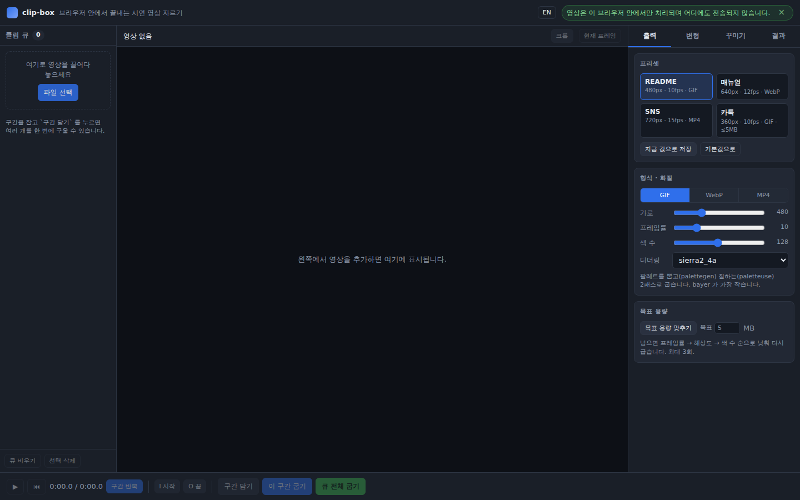

# clip-box

시연 영상에서 짧은 구간을 잘라 문서·README·SNS용 **GIF / WebP / MP4** 로 만드는 브라우저 도구입니다.
[snap-box](https://github.com/leeyunjai82/snap-box) 의 자매 도구입니다.

**→ https://leeyunjai82.github.io/clip-box/**


*위 GIF 는 clip-box 를 쓰는 화면을 녹화해서, 그 영상을 다시 clip-box 의
`README` 프리셋(480px · 10fps · GIF)에 2배속으로 넣어 구운 것입니다.*

---

## 🔒 영상은 브라우저 밖으로 나가지 않습니다

인코딩은 전부 **여러분의 PC 안에서** [`ffmpeg.wasm`](https://github.com/ffmpegwasm/ffmpeg.wasm) 으로 돌아갑니다.
업로드도, 서버도, 계정도 없습니다.

페이지를 연 뒤 **바깥으로 나가는 요청이 하나도 없습니다.** 개발자 도구 Network 탭에서
직접 확인할 수 있습니다. 라이브러리도 ffmpeg 코어도 글꼴도 전부 이 저장소에 함께 들어 있습니다.

`localStorage` 에는 마지막 프리셋과 설정값만 저장하며, 영상 데이터는 어떤 형태로도
저장하지 않습니다. 새로고침하면 작업물은 사라집니다.

---

## 쓰는 법

1. 영상을 **끌어다 놓거나** 눌러서 고릅니다. (MP4 / MOV / WebM)
2. 타임라인에서 **시작·끝 손잡이**를 끌거나, 재생 중에 `I` / `O` 키로 구간을 잡습니다.
3. 오른쪽에서 **프리셋**을 고릅니다.
4. 아래 바의 **이 구간 굽기** → 결과가 나오면 **내려받기**.

세로 영상을 놓고 README 프리셋으로 GIF 를 받는 데까지 **클릭 3번**입니다.

### 타임라인

- 아래 **필름스트립**으로 어디쯤인지 눈으로 찾습니다. 시간 눈금이 같이 붙습니다.
- **손잡이**를 끌면 시작·끝이 움직이고, **구간 안쪽**을 끌면 길이를 유지한 채 통째로 옮겨집니다.
- 구간 안쪽을 톡 누르면 그 위치로 이동만 합니다.
- 구간만 반복 재생됩니다 (아래 바의 `구간 반복`).

### 단축키

| 키 | 하는 일 |
|---|---|
| `I` / `O` | 지금 위치를 구간 시작 / 끝으로 |
| `Space` | 재생 / 멈춤 |
| `←` `→` | 한 프레임씩 (`Shift` 와 함께 1초씩) |
| `Home` / `End` | 구간 시작 / 끝으로 이동 |

---

## 프리셋

| 프리셋 | 크기 | 프레임률 | 형식 | 비고 |
|---|---|---|---|---|
| **README** | 480px | 10fps | GIF | 128색 · sierra2_4a |
| **매뉴얼** | 640px | 12fps | WebP | 품질 75 |
| **SNS** | 720px | 15fps | MP4 | 소리 없음 (고정) |
| **카톡** | 360px | 10fps | GIF | 64색 · 5MB 이하 |

값은 화면에서 바로 고칠 수 있고, **지금 값으로 저장** 을 누르면 남습니다.

---

## 할 수 있는 것

- **구간 자르기** — 손잡이 / `I`·`O` 키, 구간 반복 재생, 구간 길이·예상 용량 표시
- **크롭** — 화면에서 박스를 끌어 자릅니다. 비율 고정 `1:1` `16:9` `4:3` `9:16` `자유`.
  세로 영상에서 정사각형을 뽑을 때 씁니다.
- **배속 · 방향** — 0.5× ~ 4×, 역재생, 핑퐁(정→역)
- **목표 용량 맞추기** — 목표 MB 를 넘으면 `프레임률 → 해상도 → 팔레트 색 수` 순으로
  낮춰 다시 굽습니다 (최대 3회). 굽기 전에도 넘을 것 같으면 예상 용량이 노란색으로 바뀝니다.
  끝내 못 맞추면 가장 작게 나온 결과와 함께 알려 줍니다.
- **여러 구간 → ZIP** — 구간을 큐에 담아 한꺼번에 굽고 ZIP 으로 받습니다.
  같은 구간을 두 번 담으면 막아 줍니다.
- **글자 한 줄 / 로고** — 한글 글꼴(Pretendard)을 같이 넣어 두어 `drawtext` 로 한글이
  깨지지 않습니다. 위치는 네 모서리 + 여백.
- **페이드 인/아웃**, **현재 프레임 PNG 저장**
- **한국어 / English** 전환 (오른쪽 위 `EN` / `한`)

### GIF 는 팔레트 2패스로 굽습니다

`palettegen` 으로 그 구간에 딱 맞는 팔레트를 뽑은 뒤 `paletteuse` 로 칠합니다.
디더링은 `sierra2_4a`(기본) · `bayer` · `floyd_steinberg` · `sierra2` · `none` 중에 고릅니다.
`bayer` 가 가장 작게 나옵니다.

---

## 알아 둘 것

### 브라우저

**데스크톱 Chrome / Edge** 기준입니다. 모바일은 고려하지 않았습니다.

### 첫 로드는 약 32MB

ffmpeg 코어(wasm)를 한 번 받아야 합니다. 진행률이 화면 가운데에 나옵니다.
받은 뒤에는 Cache Storage 에 넣어 두므로 **두 번째부터는 바로 켜집니다** (측정값 0.4초).

### 300MB 넘는 영상

메모리 부족으로 실패할 수 있습니다. 경고만 하고 진행은 막지 않습니다.
폰에서 먼저 대강 잘라 오는 편이 빠릅니다.

### 아이폰 영상 (HEVC)

브라우저가 코덱을 못 풀면 **미리보기용 영상(VP8/WebM)을 자동으로 만들어** 화면에 걸어 줍니다.
이때도 **굽는 것은 언제나 원본**이라 화질은 그대로입니다.

### 회전 메타데이터

ffmpeg 이 기본으로 알아서 돌려 주고(`-autorotate`), `<video>` 도 같은 방향으로 보여 주므로
크롭 좌표가 서로 맞습니다. 그래도 옆으로 누워 나오면 **변형 → 회전** 에서 직접 고르면 됩니다.

### MP4 는 소리가 없습니다

`-an` 고정입니다. 오디오 편집은 이 도구가 하는 일이 아닙니다.

### 멀티스레드를 쓰지 않습니다

GitHub Pages 는 `COOP`/`COEP` 헤더를 줄 수 없어서 `SharedArrayBuffer` 가 막힙니다.
그래서 **싱글스레드 코어**(`@ffmpeg/core`, `core-mt` 아님)만 씁니다.

### `file://` 로는 안 열립니다

ES module + wasm worker 라 http 오리진이 필요합니다.

```bash
python3 -m http.server 8000
# http://localhost:8000
```

---

## 성능 (헤드리스 Chromium 측정)

| 작업 | 640×360 원본 | 720×1280 세로 원본 |
|---|---|---|
| 5초 구간 → README GIF (480px) | 2.1초 | 3.6초 |
| 8초 전체 → 카톡 GIF (360px) | 1.7초 | 3.3초 |
| 3초 구간 → SNS MP4 (720px) | 1.0초 | 3.1초 |
| 1:1 크롭 + 2배속 + 핑퐁 GIF | 0.9초 | 1.3초 |
| 클립 3개 일괄 + ZIP | 2.3초 | 5.3초 |

---

## 파일 구조

```
clip-box/
  index.html
  css/
    base.css       # 자매 도구 공용 껍데기 (snap-box 와 같은 값)
    style.css      # clip-box 고유 — 플레이어, 타임라인, 크롭 박스
  js/
    app.js         # 상태, 영상 로드, 클립 큐, 굽기 파이프라인
    timeline.js    # 플레이어 + 구간 드래그 + 크롭 박스
    ffmpeg.js      # 코어 로드, 명령 조립, 진행률, 취소
    presets.js     # 출력 프리셋, 예상 용량, 목표 용량 맞추기
    i18n.js        # 한국어 / English (문자열은 여기 한 곳에만)
  vendor/          # ffmpeg.wasm, 싱글스레드 코어, JSZip, 한글 글꼴
  docs/DESIGN.md   # 자매 도구 공용 디자인 기준
```

빌드 도구가 없습니다. Vanilla JS + ES modules 그대로이고, 정적 서버에 올리기만 하면 됩니다.

---

## 디자인

껍데기(색·간격·부품·레이아웃)는 **snap-box 와 같습니다.**
기준은 [`docs/DESIGN.md`](docs/DESIGN.md) 에 적어 두었고, `css/base.css` 는 두 도구가
같은 내용을 씁니다. 새 도구를 만들 때도 이 두 파일부터 가져다 씁니다.

눈으로만 맞춘 것이 아니라 두 도구를 나란히 띄워 `getComputedStyle` 로 재서 맞췄습니다.

| 대조한 것 | 결과 |
|---|---|
| 색·크기 토큰 14개 | 전부 일치 |
| 공통 부품 계산된 스타일 39종 | 전부 일치 |
| 찍힌 픽셀 (헤더 높이·색, 패널 폭, 무대 배경) | 전부 일치 |
| `base.css` ↔ snap-box `style.css` 공통 선택자 92개 | 값 전부 일치 |
| 동봉 웹폰트 | 둘 다 0개 |



> **화면이 흰색으로 보이거나 글자가 커 보이면** 브라우저에 옛 `index.html` 이
> 남아 있는 것입니다. **하드 리프레시**(Ctrl+Shift+R / Mac 은 Cmd+Shift+R) 한 번이면
> 됩니다. 지금은 그 상황을 스스로 알아채고 한 번만 다시 불러오도록 해 두었습니다.

---

## 쓴 라이브러리 · 라이선스

| 것 | 버전 | 라이선스 |
|---|---|---|
| [`@ffmpeg/ffmpeg`](https://github.com/ffmpegwasm/ffmpeg.wasm) | 0.12.15 | MIT |
| [`@ffmpeg/core`](https://github.com/ffmpegwasm/ffmpeg.wasm) (싱글스레드) | 0.12.10 | **GPL-2.0-or-later** |
| [FFmpeg](https://ffmpeg.org/) | 5.1.4 (코어 안) | **GPL-2.0-or-later** |
| [JSZip](https://stuk.github.io/jszip/) | 3.x | MIT 또는 GPLv3 |
| [Pretendard](https://github.com/orioncactus/pretendard) | 1.3.9 (`drawtext` 전용) | SIL OFL 1.1 |

UI 글꼴은 동봉하지 않습니다. 시스템의 Pretendard 를 쓰고 없으면 기본 한글 글꼴로 떨어집니다.
`vendor/fonts/` 의 TTF 는 화면용이 아니라 ffmpeg `drawtext` 가 한글을 그릴 때만 씁니다.

### ⚠️ ffmpeg 라이선스에 대해

`vendor/ffmpeg-core/` 의 ffmpeg 빌드는 **LGPL 이 아니라 GPL-2.0-or-later** 입니다.
`--enable-gpl --enable-libx264 --enable-libx265` 로 빌드되어 있기 때문입니다 (x264·x265 가 GPL).

GPL 코어를 함께 배포하므로 **이 저장소 전체를 GPL-2.0-or-later 로 둡니다.**
LGPL 로 가려면 x264/x265 없이 코어를 직접 빌드해야 하고,
그러면 **MP4(H.264) 출력이 빠집니다** (GIF·WebP 는 그대로 됩니다).

- FFmpeg 소스: https://github.com/FFmpeg/FFmpeg
- 코어 빌드 스크립트: https://github.com/ffmpegwasm/ffmpeg.wasm
