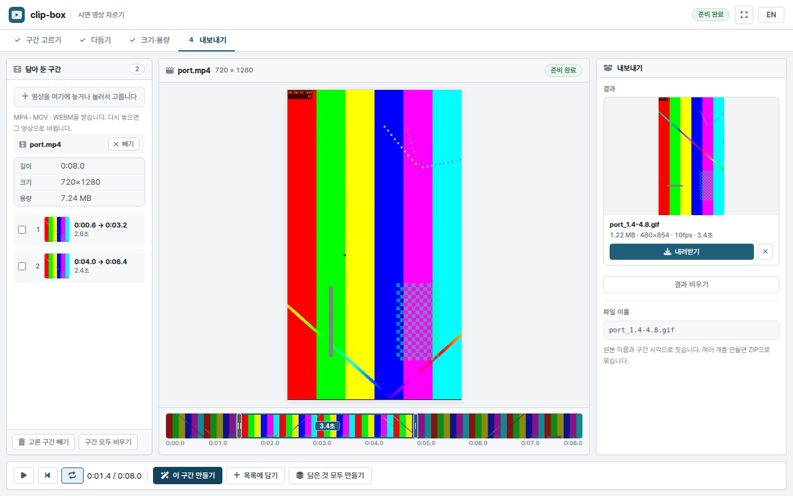

# clip-box

시연 영상에서 짧은 구간을 잘라 **문서·README·SNS용 GIF · WebP · MP4** 로 만듭니다.

### → [clip-box 열기](https://leeyunjai82.github.io/clip-box/)

설치 없이 바로 씁니다. 데스크톱 Chrome · Edge 기준입니다.



## 영상은 브라우저 밖으로 나가지 않습니다

인코딩까지 전부 이 브라우저 안에서 돕니다. ffmpeg 를 WebAssembly 로 사이트에 담아
두었기 때문에, 서버도 계정도 없고 영상이 올라가는 경로 자체가 없습니다.
쓰는 동안 바깥으로 나가는 요청이 하나도 없습니다.

- 마지막으로 쓴 **설정값만 기억하고, 영상은 어떤 형태로도 저장하지 않습니다.**
  새로고침하면 사라집니다.
- 소리는 넣지 않습니다. GIF 는 물론 MP4 도 **무음**으로 나옵니다.
- 처음 한 번만 32MB 짜리 코어를 읽습니다. 그다음부터는 브라우저 캐시에서 바로 뜹니다.

## 쓰는 순서

영상을 왼쪽에 끌어다 놓으면 (MP4 · MOV · M4V · WEBM · MKV) 바로 필름이 깔리고 앞 5초가 잡힙니다.
다른 영상을 다시 놓으면 그 영상으로 바뀌고, 파일 이름 옆 **빼기**로 뺍니다.
아이폰 HEVC 처럼 브라우저가 못 읽는 코덱이면 미리보기용 영상을 따로 만들어 보여 줍니다.
**만드는 것은 언제나 원본입니다.**

- **1 구간 고르기** — `3초 · 5초 · 10초 · 전체` 중 하나를 누르면 그만큼 잡힙니다.
  더 정확히는 필름에서 파란 손잡이를 끌거나, 재생 중에 `I`·`O` 키로 잡습니다.
  구간 안쪽을 끌면 길이를 유지한 채 통째로 옮겨집니다
- **2 다듬기** — 잘라내기(비율 고정) · 배속 · 역재생 · 핑퐁.
  회전 · 페이드 · 글자 한 줄(한글 됩니다) · 로고는 **자세히** 안에 있습니다
- **3 크기·용량** — 쓸 곳을 고르고 `작게 · 보통 · 크게`, 형식만 정하면 끝입니다.
  가로 · 프레임 · 화질 · **목표 용량**은 **자세히** 안에 있습니다
- **4 내보내기** — 한 개씩 내려받거나, 여러 구간을 담아 **ZIP** 으로 한꺼번에

자주 쓰지 않는 것은 전부 `자세히` 로 접어 두었습니다. 첫 화면에 보이는 것만 만지면 됩니다.

| 프리셋 | 형식 | 크기 | 쓰는 곳 |
| --- | --- | --- | --- |
| README | GIF | 480px · 10fps | 저장소 문서에 바로 붙이는 짧은 장면 |
| 매뉴얼 | WebP | 640px · 12fps | 같은 용량에 더 곱게 — 웹 매뉴얼용 |
| SNS | MP4 | 720px · 15fps | 길고 매끄러운 장면 |
| 메신저 | GIF | 360px · 10fps | 5MB 를 넘지 않게 자동으로 맞춥니다 |

값을 고쳐 **지금 값으로 저장**을 누르면 다음에도 그대로 나옵니다.


만드는 동안에는 설정이 잠기고 **그만두기**만 남습니다. 그만두면 하던 일만 버리고
바로 다시 만들 수 있습니다.

---

<details>
<summary>개발자용</summary>

### 담겨 있는 것

| | 버전 | 라이선스 |
| --- | --- | --- |
| [`@ffmpeg/ffmpeg`](https://github.com/ffmpegwasm/ffmpeg.wasm) | 0.12.15 | MIT |
| [`@ffmpeg/core`](https://github.com/ffmpegwasm/ffmpeg.wasm) (싱글스레드, ffmpeg 5.1.4) | 0.12.10 | **GPL-2.0-or-later** |
| [JSZip](https://stuk.github.io/jszip/) | 3.10.1 | MIT |
| [Pretendard](https://github.com/orioncactus/pretendard) | — | OFL-1.1 |
| [Font Awesome Free](https://fontawesome.com/) | 6.2.0 | CC BY 4.0 · SIL OFL 1.1 · MIT |

자막용 `Pretendard-Bold.ttf` 는 ffmpeg 의 `drawtext` 에 넘기려고 따로 담았습니다.
서비스 마크는 자체 제작입니다.

**코어가 GPL 이므로 이 저장소 전체를 [GPL-2.0-or-later](LICENSE) 로 냅니다.**
`@ffmpeg/core` 는 `--enable-gpl` 로 빌드된 배포본입니다 (LGPL 아님).

### 멀티스레드를 안 쓰는 이유

`core-mt` 는 `SharedArrayBuffer` 가 있어야 하고, 그러려면 `COOP`·`COEP` 헤더를 서버가
보내 줘야 합니다. GitHub Pages 는 헤더를 못 바꿉니다. 그래서 싱글스레드 코어만 씁니다.
대신 wasm 이 한 번 메모리 트랩을 내면 그 인스턴스는 못 살리므로,
`exec` 을 여덟 번 부를 때마다 워커를 새로 띄웁니다.

### 직접 열 때

`index.html` 을 그대로 열면 화면은 그대로 뜨지만 **만들지는 못합니다** —
Chrome 이 `file://` 오리진의 `fetch` 를 막아 wasm 코어를 못 읽습니다.
로컬에서 쓰려면 정적 서버를 하나 띄우세요.

```
python3 -m http.server 8080
```

### 디자인

**업무 도구 킷**(`css/maker-tool.css`)입니다. 자매 서비스인
[snap-box](https://github.com/leeyunjai82/snap-box) 와 같은 킷을 씁니다.
기준은 [`design/README.md`](design/README.md), 컴포넌트 실물은
[`design/preview.html`](design/preview.html).

킷은 고치지 않습니다. clip-box 전용 CSS 는 `css/app.css` 한 곳에만 씁니다.
화면 문자열도 `js/i18n.js` 한 곳에만 둡니다 — 한국어 원문이 그대로 키입니다.

</details>
